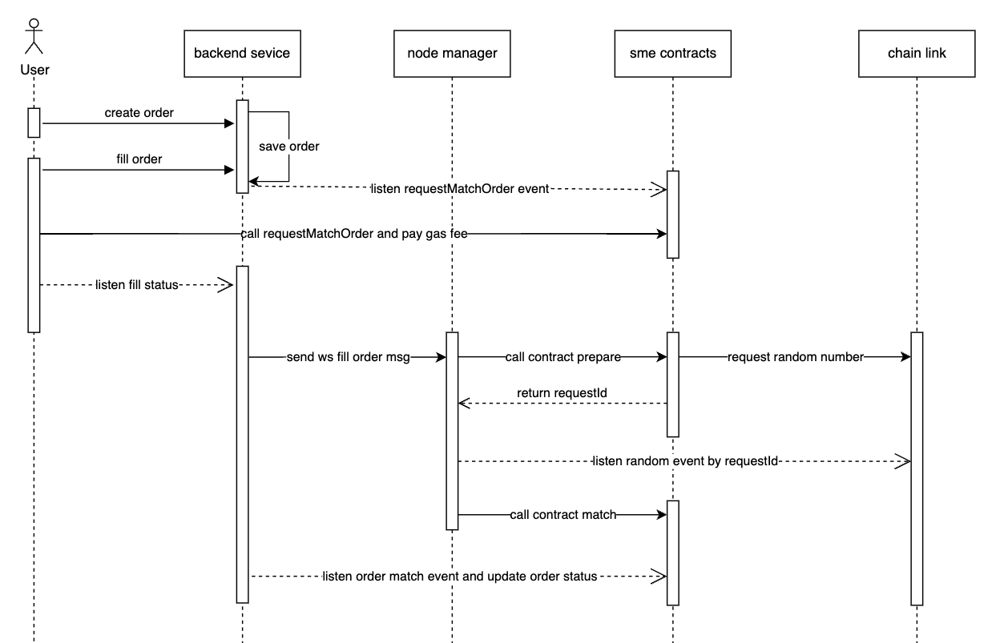

# SSE contracts

The SSE contracts is a market protocol for safely and efficiently buying and selling NFTs.


## System Architecture Diagram



## Install

To install dependencies and compile contracts:

```bash
$ git clone https://github.com/0xMCG/sse-contracts && cd sse-contracts
$ yarn
$ yarn build
```

## Usage

To run hardhat tests written in javascript:

1.Rebuild all contracts and run tests
```bash
$ yarn test
```

2.Rebuild changed contracts and run tests
```bash
$ yarn test:quick
```
## License

[MIT](LICENSE) Copyright 2023 Ozone Networks, Inc.